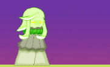
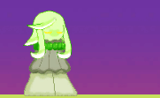

# RuneFae

### A 2D Rogue-Like Game Demo

Explore a large level and defeat enemies in close-quarters with your strong melee slashes or stay safe and slowly whittle them down with ranged spells. Using the spirits dropped by enemies, head to a shop to improve you stats or even gain new powers. Not all shops are the same as some have stronger upgrades so keep an eye out for them. If you think you're strong enough, make your way to the boss teleporter that hides in random places around the map and face off against the boss!
 

To play, download the latest veriosn from the Releases tab. Unzip the folder and look for the RuneFae Unity application, then doube-click to launch and enjoy playing the game!
     

<ins>Background Information </ins>

This project was created as my Senior Design Project. I wanted to do something that would allow me to both create code and art assets, and so this game demo came to be. Specifically, I created all the character, enemy, and boss sprites as well as wrote all the scripts. Other assets came from the Unity Asset Store and are linked at the bottom of the README. The game can be played from start to end despite the many bugs. For the most part, the initial commit of this project reflects the version of the game that was submitted in my final university semester. Recently, I have fixed some of the more obvious issues such as camera and sound issues in the boss level that prevented the player from beating the game in this updated version of the game.

<ins>Known Issues </ins>
- No End Screen: Finishing the game shows an image but doesn't actually give the players the option to restart or exit out
- Lack of Transitions: Changing between scenes is abrubt because no transitions have been implemented
- Unresponsive Shop/Teleporter: Attempting to open up the shop or use the boss teleporter doesn't always work, you need to move the character around a bit and repeatedly press the 'F' key
- No Upgrade Limits: There is no hardcap to health or speed upgrades so technically you could attempt to reach mach speed

__This demo has not been extremely tested and other miscellaneous issues can occur__
   

### See the Game In Action
*Audio is not present here but does play in-game*

    
*Check out the different forms!*

   

<ins>External Assets Used </ins>

* Sound
    - [Mai Free Voices](https://assetstore.unity.com/packages/audio/sound-fx/voices/mai-free-voices-52907) by nagisa.f
    - [Voices Sfx](https://assetstore.unity.com/packages/audio/sound-fx/voices/voices-sfx-41754) by Little Robot Sound Factory
    - [Demo Ancient Magic Pack FREE](https://assetstore.unity.com/packages/audio/sound-fx/weapons/demo-ancient-magic-pack-free-175093) by SF Audio Guild
    - [8-bit Fantasy & Adventure Music](https://assetstore.unity.com/packages/audio/music/electronic/8-bit-fantasy-adventure-music-211334) by Marllon Silva (xDeviruchi)

* Font
    - [Free Pixel Font - Thaleah](https://assetstore.unity.com/packages/2d/fonts/free-pixel-font-thaleah-140059) by Tiny Worlds

* Tileset
    - [FREE PLATFORMER GAME TILESET](https://www.gameart2d.com/free-platformer-game-tileset.html) from Game Art 2D

<ins>To-Do List </ins>

- Update videos to also include sound
- Work on known issues
